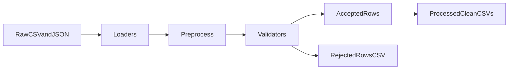

# fit_support

Local-first multimodal RAG fitness assistant for personalized exercise recommendations.

## Current milestone
- M1 through M5 complete.

## Task checklist
- [x] Define architecture-first folder structure and module placeholders.
- [x] Implement ingestion contracts and modality parsers.
- [x] Persist normalized records with embeddings into Chroma modality collections.
- [x] Add ingestion tests and data quality checks.
- [x] Implement multimodal retrieval merge/rerank with injury-aware filtering.
- [x] Add retrieval tests and validate retrieval relevance on sample queries.
- [x] Add baseline-vs-RAG evaluation harness.

## Blockers
- No labeled retrieval dataset yet for robust metric-driven tuning.
- Image metadata remains sparse unless naming conventions are enforced in raw data files.

## Bugs
- No known runtime bugs currently.

## Technical debt
- `EmbeddingService` instantiates models eagerly; should be cached/lazy for faster CLI startup.
- Retrieval currently performs simple modality merge; can add reciprocal-rank fusion later.
- Legacy placeholder modules under `src/ingestion`, `src/embeddings`, and `src/retrieval` should be removed once migration is confirmed.

## Decision log
- Use separate Chroma collections per modality: workouts, lifts, injuries, images.
- Use sentence-transformers for text and CLIP-compatible model path for images.
- Keep implementation local-first using filesystem + persistent Chroma database.

---

## Project Goal
Build a local-first multimodal RAG fitness assistant that ingests workout history, lift progression, injury context, and exercise images, then retrieves personalized evidence for recommendation generation.

## Architecture Decisions
- Python + uv for a reproducible local development workflow.
- ChromaDB persistent local storage for modality-specific vector collections.
- sentence-transformers for text embeddings due to strong local inference support.
- CLIP-style image embeddings for image/text retrieval compatibility.
- LangGraph retrieval orchestration to keep pipeline state and graph logic explicit.
- Shared `ContextChunk` schema to keep ingestion and retrieval interfaces consistent.

## Implementation Log
### Day 1
- What was built:
  - Architecture scaffold under `src/fit_support` (`config`, `domain`, `ingest`, `embeddings`, `retrieval`, `graph`, `eval`).
  - Data directory setup for raw, processed, chroma, and eval datasets.
  - Ingestion pipeline for workouts (`.txt`), lifts (`.csv`), injuries (`.txt`), and exercise images.
  - Embedding service and Chroma upsert/query integration with per-modality collections.
  - Retrieval service with injury-aware reranking and LangGraph workflow wrapper.
  - Evaluation rubric and baseline-vs-RAG comparison harness.
  - Test suite for ingestion, retrieval, and evaluation.
- Issues faced:
  - Initial pytest run had incomplete output due to first-time dependency install timing.
  - Deprecation warning from `datetime.utcnow()`.
  - Sparse image metadata limits retrieval quality.
- Fixes:
  - Re-ran tests with quiet mode after environment setup completed.
  - Switched timestamp default to timezone-aware `datetime.now(UTC)`.
  - Added risk tracking and decision notes to enforce metadata conventions.
- Next milestone:
  - Build labeled retrieval/evaluation dataset and offline relevance metrics (`Recall@k`, `nDCG`) before UI work.

## Current Folder Structure
- `main.py`
- `TASKS.md`
- `src/fit_support/config`
- `src/fit_support/domain`
- `src/fit_support/ingest`
- `src/fit_support/ingestion`
- `src/fit_support/embeddings`
- `src/fit_support/retrieval`
- `src/fit_support/graph`
- `src/fit_support/eval`
- `tests`
- `data/raw/workouts`
- `data/raw/lifts`
- `data/raw/images`
- `data/raw/injuries`
- `data/processed`
- `data/chroma`
- `data/eval`

## Dependencies
- `chromadb`
- `langgraph`
- `numpy`
- `opencv-python`
- `pandas`
- `pillow`
- `pydantic`
- `pydantic-settings`
- `pytest`
- `python-dotenv`
- `sentence-transformers`
- `streamlit`

## Future Improvements
- Add lazy/cached model loading to reduce startup time.
- Introduce stronger retrieval fusion/reranking and modality weighting.
- Enforce a richer image metadata schema (exercise, body part, equipment, constraints).
- Add held-out query benchmark set and automated regression checks.
- Add CLI scoring reports comparing baseline and RAG outputs across scenarios.

### Day 2
- What was built:
  - Plan-aligned `src/fit_support/config.py` module with environment-backed typed settings.
  - Required folder validation updated to include `data/raw/metadata` and `chroma_db`.
  - Added `src/fit_support/ingestion/schemas.py` with Pydantic metadata/ingested record models.
  - Expanded ingestion interfaces with `MetadataRepository` in `src/fit_support/ingestion/interfaces.py`.
  - Updated `TASKS.md` lifecycle sections (`Current phase`, `Checklist by phase`, `Blockers`, `Bugs`, `Technical debt`, `Decision log`).
- Issues faced:
  - `main.py` smoke run initially failed with `ModuleNotFoundError` for local package import.
  - LangGraph emitted a serializer deprecation warning during startup.
- Fixes:
  - Added deterministic `src` path bootstrap in `main.py` so local execution works via `uv run python main.py`.
  - Kept warning documented and scoped as non-blocking; no functional impact on ingestion/retrieval path.
- Next milestone:
  - Add metadata file loader implementation that maps structured exercise metadata directly into retrieval filters.

## Current Folder Structure (Update)
- Added `src/fit_support/config.py` (plan-compliant config module).
- Added `src/fit_support/ingestion/schemas.py`.
- Added `data/raw/metadata`.
- Added `chroma_db`.

## Data architecture

Raw lift and workout data are split by intent so the RAG pipeline can treat baselines differently from session logs.

| Path | Role |
|------|------|
| `data/raw/metadata/exercise_library.csv` | Canonical exercise names and attributes (source of truth for naming). |
| `data/raw/lifts/strength.csv` | Personal baselines, PRs, and max-effort reference rows (`exercise_name`, `best_weight_kg`, `best_reps`, `notes`). |
| `data/raw/workouts/workout_log.csv` | Dated session sets (`date`, `exercise_name`, `set_number`, `weight_kg`, `reps`, `notes`). |
| `data/processed/migrations/` | Timestamped backups of merged legacy files (e.g. `lifts_log_backup_*.csv`) before destructive splits. |
| `data/processed/*_clean.csv` | Validated, normalized snapshots produced by `src/ingestion/pipeline.py` (`--data-pipeline`). |
| `data/eval/rejected_rows.csv` | Rows that failed validation, with JSON payload and error text for debugging. |

Legacy `data/raw/lifts/lifts_log.csv` mixed baselines into a session-shaped schema; `scripts/refactor_lift_workout_data.py` moves baseline/PR rows into `strength.csv`, writes real sessions to `workout_log.csv`, maps `UNKNOWN` to empty fields, normalizes names to the library, and warns on library mismatches. Re-run with `--dry-run` to preview.

### Day 3
- What was built:
  - Automated refactor script `scripts/refactor_lift_workout_data.py` (split, clean, validate against `exercise_library.csv`).
  - `data/raw/lifts/strength.csv` and `data/raw/workouts/workout_log.csv`; legacy `lifts_log.csv` backed up then removed.
  - `WorkoutIngestor` now ingests `*.csv` session logs under `data/raw/workouts/` in addition to `*.txt`.
- Issues faced:
  - Legacy first column was mislabeled (`isdate` vs `date`); script uses the first column as session marker for classification.
- Fixes:
  - Classify rows with `BASELINE` / `PR` / baseline-related notes into strength; session-shaped rows go to `workout_log.csv`.
  - Post-write validation warns if any `exercise_name` is absent from the library.
- Next milestone:
  - Wire explicit `record_type` metadata in Chroma for strength vs session chunks if retrieval should rank them differently.

### Day 4 — Phase 1 data ingestion pipeline
- What was built:
  - New package `src/ingestion/` with `models.py` (Pydantic: `ExerciseMetadata`, `LiftRecord`, `WorkoutRecord`, `InjuryRecord`), `validators.py`, `loaders.py`, `preprocess.py`, and `pipeline.py`.
  - End-to-end flow **load → validate → preprocess → save** with tagged logs: `[LOAD]`, `[VALIDATE]`, `[CLEAN]`, `[SAVE]`.
  - Clean outputs under `data/processed/`: `exercises_clean.csv`, `lifts_clean.csv`, `workouts_clean.csv`, `injuries_clean.csv`.
  - Rejected rows collected in `data/eval/rejected_rows.csv` (schema: `phase`, `source`, `row_index`, `payload_json`, `errors`) without aborting the whole run.
  - CLI: `uv run python main.py --data-pipeline` (lazy-imports RAG stack so this path stays lightweight).
- Architecture:
  - **Loaders** scan `data/raw/lifts/*.csv`, `data/raw/workouts/*.csv`, `data/raw/injuries/*.json`, and `data/raw/metadata/*.{csv,json}`.
  - **Preprocess** normalizes whitespace, maps `UNKNOWN` to null, coerces numbers/dates, and fuzzy-maps exercise names to `exercise_library.csv`.
  - **Validators** combine Pydantic validation with extra checks (non-negative weight/reps, library membership, duplicate keys per stream).
  - **Pipeline** orchestrates row-by-row handling: bad rows go to `rejected_rows.csv`; good rows accumulate then flush to processed CSVs.
- Data flow (high level):

- Issues encountered:
  - Initial `main.py` always imported LangGraph-backed RAG modules, which added noise when only running the data pipeline.
  - Empty `workout_log.csv` / injury JSON files needed explicit empty CSV headers on write.
- Fixes:
  - Branch `main.py` so `--data-pipeline` only imports `ingestion.pipeline`.
  - Dedupe strength and workout streams while ingesting; write empty DataFrames with fixed column headers when no rows pass validation.
- Next milestone:
  - Point the existing Chroma / embedding ingest path at `data/processed/*.csv` as an optional second stage, or add a small adapter that reads clean files into `ContextChunk` records.

### Day 5 — Phase 2 multimodal embedding + retrieval
- What was built:
  - New multimodal modules under `src/embeddings/`: `text_embedder.py`, `image_embedder.py`, `index_builder.py`, `__init__.py`.
  - New retrieval query surface under `src/retrieval/`: `search.py`, `__init__.py`.
  - Text embedding index includes exercise metadata (`exercise_name`, `movement_pattern`, `equipment`, `muscle groups`) and lift history (`strength.csv`) in Chroma collection `fitness_text`.
  - Image embedding index ingests nested image folders under `data/raw/images/` into Chroma collection `fitness_images`.
  - Index persistence path standardized to `data/chroma/`.
- Architecture:
  - **Text model**: `sentence-transformers/all-MiniLM-L6-v2`.
  - **Image model**: `clip-ViT-B-32` via sentence-transformers (CLIP-compatible).
  - **Collections**: `fitness_text`, `fitness_images`.
  - **Stored fields**: `id`, embedding vector, metadata, and `source_path` for provenance.
- Data flow:
  - Build records from `exercise_library.csv` + `strength.csv` for text.
  - Build records from image files recursively for image embeddings.
  - Upsert both modalities to Chroma, then run retrieval smoke queries.
- Retrieval examples executed:
  - `"knee friendly quad exercise"` → top included `Hack Squat`, `Leg Extension`, `Back Squat`.
  - `"upper chest press"` → top included `Chest Press Machine`, `Incline Chest Press Machine`.
  - `"lat focused back movement"` → top included `Lat Pulldown` and row-type lift context.
  - Image query on `bent_over_row/finish.jpeg` returned same-exercise frames (`finish`, `start`, `mid`) as top matches.
- Issues encountered:
  - Initial index run was slow because search smoke tests reloaded models repeatedly.
- Fixes:
  - Added optional embedder reuse in `retrieval/search.py` and reused existing model instances in `index_builder.py`.
  - Rebuild now resets `fitness_text` and `fitness_images` before upsert, then verifies expected counts and duplicate-free IDs.
  - Generated Chroma files under `data/chroma/` are ignored by git; the local DB is rebuilt from raw sources.
- Next milestone:
  - Add reranking and modality fusion strategy (text + image + lift priors) for recommendation-time context assembly.
